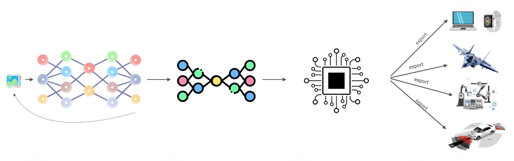

# Welcome to my GitHub profile! 👋

I'm **Sai Manohar Vemuri**, a Ph.D. student and AI researcher with a strong passion for cutting-edge research in deep learning, neural architecture search (NAS), and edge AI optimization. My research is deeply focused on developing advanced techniques for object detection, semantic segmentation, and sensor fusion in autonomous systems, while also emphasizing efficient deployment on a variety of hardware platforms such as **FPGAs**, **GPUs**, and **embedded devices**.

## 🔬 Research Interests

### **Computer Vision & Deep Learning**
- Specializing in **object detection**, **semantic segmentation**, and **instance segmentation** using state-of-the-art techniques like **YOLOv4**, **Faster R-CNN**, **Mask R-CNN**, and **EfficientNet**.
- Exploration of **Generative Adversarial Networks (GANs)** for data augmentation, improving model generalization, and enhancing segmentation results.
- Working on advanced models such as **transformers** for 3D point cloud data processing, especially for autonomous driving and **ADAS (Advanced Driver Assistance Systems)**.

### **Edge AI & HW/SW Co-design**
- Focusing on optimizing AI models for edge devices like **FPGAs**, **Jetson**, and **mobile systems** to achieve **low power** and **high-efficiency** solutions for real-time processing.
- Implementing **HW/SW co-design** principles to efficiently deploy deep learning models on edge devices, using techniques such as **quantization**, **model pruning**, and **neural architecture search** (NAS).
- Integrating **sensor fusion** from LiDAR and camera data to improve the robustness and accuracy of AI models for autonomous systems, while ensuring these models are optimized for low-latency deployment.

### **AI Security & Audio Processing**
- Developing cutting-edge solutions for **robust audio watermarking**, ensuring the **authenticity** and **traceability** of audio signals in dynamic environments.
- Working on **real-time detection systems for AI-generated speech**, including deepfake detection and addressing the emerging challenges of **synthetic voice detection**.
- Researching techniques for protecting **audio content** from unauthorized use, leveraging advanced signal processing and machine learning methods.

### **Model Optimization**
- Using **Neural Architecture Search (NAS)** to discover efficient model architectures tailored for specific tasks and hardware platforms.
- Applying **quantization**, **knowledge distillation**, and **pruning** techniques to reduce model size and improve inference speed, making models suitable for edge devices without compromising on performance.
- Exploring novel methods for optimizing models at both the architectural and **hardware** level to improve deployment efficiency, especially on low-power devices like FPGAs and embedded systems.

---

Feel free to explore my repositories and projects to see how I tackle real-world problems using these advanced techniques. I am always looking for new challenges and opportunities to collaborate on impactful AI research!
